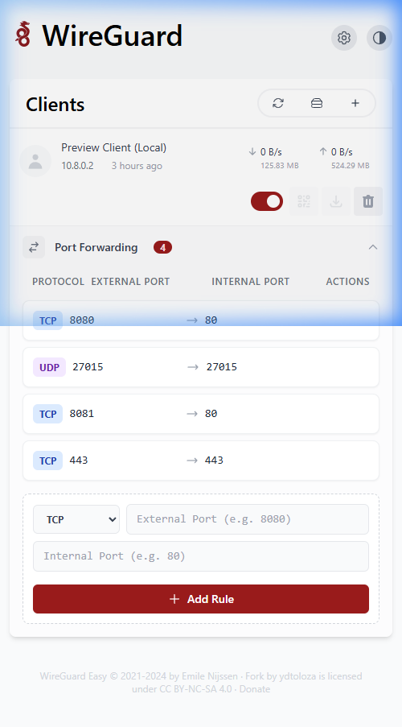

# WG-Easy Port Manager (Advanced Fork)

[](https://github.com/ydtoloza/wg-easy-port-manager/actions/workflows/deploy.yml)
[](https://creativecommons.org/licenses/by-nc-sa/4.0/)


<p align="center">
  
</p>

### 📸 UI Preview (Port Forwarding Manager)
<p align="center">
  
</p>

---

[🇺🇸 English](#english) | [🇪🇸 Español](#español)

---

<a name="español"></a>
## 🇪🇸 Español

> **Aviso**: Este proyecto es un fork especializado del [wg-easy](https://github.com/wg-easy/wg-easy) original de Weejewel. Este fork introduce características avanzadas de red y mejoras en la interfaz que no están presentes en el repositorio original, diseñadas específicamente para usuarios avanzados que requieren una gestión profesional de redireccionamiento de puertos.

### 🚀 Características Principales y Mejoras

Este fork mantiene la simplicidad de la interfaz original de WireGuard e introduce potentes capacidades nuevas:

*   **Gestor de Puertos por Cliente (DNAT/Port Forwarding)**: Una interfaz totalmente integrada para gestionar el redireccionamiento de puertos por cada cliente de WireGuard. Puedes mapear dinámicamente puertos externos del servidor a las IPs internas de los clientes.
*   **Soporte para Protocolo "Ambos" (TCP + UDP)**: Capacidad de abrir puertos tanto en TCP como en UDP con una sola regla, ideal para juegos y servicios complejos.
*   **Integración Automatizada con `nftables`**: El backend provisiona, sincroniza y limpia automáticamente las reglas DNAT de `nftables` basándose en la configuración de la interfaz. No requiere configuración manual del firewall.
*   **Validación en Tiempo Real**: La interfaz te avisa instantáneamente si intentas usar un puerto que ya está ocupado o reservado.
*   **Estabilidad Mejorada**: Se corrigieron condiciones de carrera (race conditions) durante la inicialización de WireGuard, asegurando un arranque mucho más estable.
*   **Gestión de Sesiones Robusta**: Se resolvieron problemas de bloqueos silenciosos durante el inicio de sesión y caídas de tokens de autenticación en entornos con proxy inverso o alta latencia.
*   **Soporte para Modo de Red Host**: Optimizado para ejecutarse con `network_mode: "host"` para obtener el máximo rendimiento.

### 🛠 Instalación y Despliegue

Desplegar este fork es tan sencillo como ejecutar un archivo `docker-compose.yml`.

#### Requisitos Previos

Asegúrate de que tu sistema cumple con lo siguiente:
* Docker y Docker Compose instalados.
* `nftables` e `iptables` disponibles en el sistema host.
* Módulo del kernel de WireGuard cargado.

#### Ejemplo de `docker-compose.yml`

```yaml
volumes:
  etc_wireguard:

services:
  wg-easy-port-manager:
    image: ghcr.io/ydtoloza/wg-easy-port-manager:latest
    container_name: wg-easy-port-manager
    environment:
      - LANG=es # Idioma de la interfaz
      - WG_HOST=TU_IP_PUBLICA # Cambia por la IP pública de tu servidor
      - PASSWORD_HASH=$$2y$$10$$hBCoykrB95WSzuV4fafBzOHWKu9sbyVa34GJr8VV5R/pIelfEMYyG # Genera tu propio hash bcrypt
      - WG_PERSISTENT_KEEPALIVE=25
      - WG_DEVICE=eth0 # Cambia si tu interfaz principal no es eth0
      # Reglas necesarias para permitir el acceso a internet a los clientes conectados
      - WG_POST_UP=iptables -t nat -A POSTROUTING -s 10.8.0.0/24 -o eth0 -j MASQUERADE; iptables -I INPUT -p udp -m udp --dport 51820 -j ACCEPT; iptables -I FORWARD -i wg0 -j ACCEPT; iptables -I FORWARD -o wg0 -j ACCEPT;
      - WG_POST_DOWN=iptables -t nat -D POSTROUTING -s 10.8.0.0/24 -o eth0 -j MASQUERADE; iptables -D INPUT -p udp -m udp --dport 51820 -j ACCEPT; iptables -D FORWARD -i wg0 -j ACCEPT; iptables -D FORWARD -o wg0 -j ACCEPT;
    volumes:
      - etc_wireguard:/etc/wireguard
    restart: unless-stopped
    network_mode: "host" # Modo de red de alto rendimiento
    cap_add:
      - NET_ADMIN
      - SYS_MODULE
      - NET_RAW
```

> **Nota sobre `PASSWORD_HASH`**: No uses contraseñas en texto plano. Debes generar un hash bcrypt. En docker-compose, escapa los símbolos `$` usando doble `$$`.

---

<a name="english"></a>
## 🇺🇸 English

> **Disclaimer**: This project is a specialized fork of the original [wg-easy](https://github.com/wg-easy/wg-easy) by Weejewel. This fork introduces advanced networking features and interface enhancements not present in the upstream repository, specifically tailored for power users requiring advanced port forwarding management.

### 🚀 Key Features & Enhancements

This fork maintains the simplicity of the original WireGuard UI while injecting powerful new capabilities:

*   **Peer Port Manager (DNAT/Port Forwarding)**: A fully integrated UI to manage port forwarding per WireGuard peer. You can dynamically map external server ports to internal peer IPs.
*   **"Both" Protocol Support (TCP + UDP)**: Ability to open both TCP and UDP ports with a single rule, perfect for games and complex services.
*   **Automated `nftables` Integration**: The backend automatically provisions, syncs, and flushes `nftables` DNAT rules based on the UI configuration. No manual firewall configuration required.
*   **Real-Time Validation**: The UI instantly warns you if you try to use a port that is already occupied or reserved.
*   **Enhanced Stability**: Fixed underlying race conditions during WireGuard initialization, ensuring a smoother startup sequence.
*   **Robust Session Management**: Resolved silent hanging issues during login and authentication token drops in reverse-proxy or high-latency environments.
*   **Host Network Mode Support**: Optimized to run with `network_mode: "host"` for maximum performance and reduced overhead.

### 🛠 Installation & Deployment

Deploying this fork is as simple as running a `docker-compose.yml` file.

#### Prerequisites

Ensure your host system meets the following requirements:
* Docker & Docker Compose installed.
* `nftables` and `iptables` available on the host system.
* WireGuard kernel module loaded.

#### Example `docker-compose.yml`

```yaml
volumes:
  etc_wireguard:

services:
  wg-easy-port-manager:
    image: ghcr.io/ydtoloza/wg-easy-port-manager:latest
    container_name: wg-easy-port-manager
    environment:
      - LANG=en # Set UI Language
      - WG_HOST=YOUR_SERVER_IP # Change to your server's public IP
      - PASSWORD_HASH=$$2y$$10$$hBCoykrB95WSzuV4fafBzOHWKu9sbyVa34GJr8VV5R/pIelfEMYyG # Replace with your bcrypt hash
      - WG_PERSISTENT_KEEPALIVE=25
      - WG_DEVICE=eth0 # Change if your main interface is not eth0
      # Required rules to allow internet access to connected peers
      - WG_POST_UP=iptables -t nat -A POSTROUTING -s 10.8.0.0/24 -o eth0 -j MASQUERADE; iptables -I INPUT -p udp -m udp --dport 51820 -j ACCEPT; iptables -I FORWARD -i wg0 -j ACCEPT; iptables -I FORWARD -o wg0 -j ACCEPT;
      - WG_POST_DOWN=iptables -t nat -D POSTROUTING -s 10.8.0.0/24 -o eth0 -j MASQUERADE; iptables -D INPUT -p udp -m udp --dport 51820 -j ACCEPT; iptables -D FORWARD -i wg0 -j ACCEPT; iptables -D FORWARD -o wg0 -j ACCEPT;
    volumes:
      - etc_wireguard:/etc/wireguard
    restart: unless-stopped
    network_mode: "host"
    cap_add:
      - NET_ADMIN
      - SYS_MODULE
      - NET_RAW
```

---

## 🤝 Credits & Upstream

All credit for the original design and core application architecture goes to [Weejewel](https://github.com/weejewel/wg-easy). Developed and maintained as a fork by [ydtoloza](https://github.com/ydtoloza/wg-easy-port-manager).
